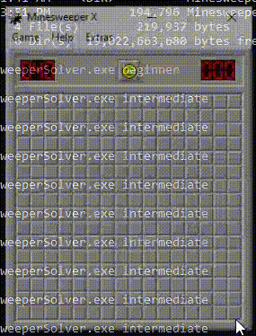
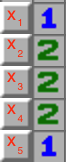
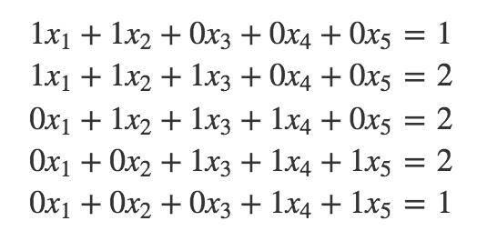

# MinesweeperSolver




Automated end-to-end Minesweeper solver in Windows environment (written in C).
The solver implements the image-processing of board detection, move execution and planning.


## Building
In order to build and execute MinesweeperSolver do the following:

### Prerequisites
You must have Windows environment and gdi32.dll, CMake, and Make installed over your machince.

### Build
```bash
git clone https://github.com/yotamsali/MinesweeperSolver.git
cmake MinesweeperSolver
make
```

### Execution
```bash
MinesweeperSolver.exe {level}
```
The parameter level can be either "beginner", "intermediate" or "expert".

If Minesweeper app is not opened once executing, verify that the "Minesweeper X.exe" relative path to MinesweeperSolver, is as stated in src/hard_coded_config.h.
Otherwise, change the "MINESWEEPER_PATH" parameter. However, there shouldn't be any problems because game is cloned in the correct version and path.

## Design

MinesweeperSolver design is based on the following modules:

### Board
Responsible for detection of board cells and game status (smiley state).
The module's way of action is taking a screenshot of Minesweeper window, splitting into cells,
and detecting each cell based on special "magic" colors that specify every cell type.
Detecting smiley is based on yellow-back colors ratio around the smiley.

<p align="center">
  
</p>


### Commander
Move execution (cursor control), Minesweeper window screenshots, and other Windows API based calls.

### BoardAnalyzer
The "brain" of the program, determines moves according to board state.
1. Creates set of linear of equations over unknown cells.
2. Solves deterministic solutions in 0-1 variables (using Gaussian elimination).
3. In case program doesn't recognize deterministic cell, it makes the best guess over a clear cell.
Guessing is done when no deterministic cell is detected, and in a probability-based method.
Deeper explanation is within source comments.

Implementation is based in some parts on the great article https://massaioli.wordpress.com/2013/01/12/solving-minesweeper-with-matricies/.

Here is a little example for the creation of such linear equations system:

<p align="center">
  
</p>
<p align="center">
  
</p>

### MinesweeperSolver
Main program. Runs the program logic.

### Logger
Responsible for program logging.

### Matrix
Heap allocated matrix utilities.


## Error Handling

In case of unexpected result the program will return a non-zero error code.
All error codes are stated in "src/error_codes.h" file.


## Logging 

MinesweeperSolver writes a log in every execution, under a directory named "Logs".
Log files are named after the execution date and hour.
Logging is splitted into two levels: "Runtime" and "Debug". In default, only "Runtime" logs are written, but it can be configured under "hard_coded_config.h".


## Bug reports

Please file bug reports at https://github.com/yotamsali/MinesweeperSolver/issues

## Authors

Yotam Sali, Israel, 2020.
